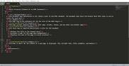

<!DOCTYPE html>
<html lang="en">
    <head>
        <title>HTML &ndash; Google Search</title>
        <link rel="stylesheet" type="text/css" href="styles/style.css">
        <link rel="stylesheet" type="text/css" href="styles/search-styles.css">        
        <link rel="stylesheet" href="https://maxst.icons8.com/vue-static/landings/line-awesome/line-awesome/1.3.0/css/line-awesome.min.css">
    </head>
    <body>
        <header>
            
            <form>
                <input type="text">
                
            </form>
            <ul class="right-list">
                <li class="apps"></li>
                <li><a href="#"><button class="sign-button">Sign Up</button></a></li>
            </ul>
            

                <ul>
                    <li class="active"><i class="las la-search"></i><a href="#">All</a></li>
                    <li><a href="#"><i class="las la-image"></i>Images</a></li>
                    <li><a href="#"><i class="lab la-youtube"></i>Videos</a></li>
                    <li><a href="#"><i class="las la-book"></i>Books</a></li>
                    <li><a href="#"><i class="las la-newspaper"></i>News</a></li>
                    <li><a href="#"><i class="las la-ellipsis-v"></i>More</a></li>
                </ul>
                <ul class="menu-right">
                    <li><a href="#">Settings</a></li>
                    <li><a href="#">Tool</a></li>
                </ul>
            

        </header>

        

            <main class="search-results">
                

                    
About 25,270,000,000 results (0.53 seconds)

                    

                        

                            HTML (HyperText Markup Language) is the most basic building block of the Web. 
                            It defines the meaning and structure of web content. Other technologies 
                            besides HTML are generally used to describe a web page's 
                            appearance/presentation (CSS) or functionality/behavior (JavaScript). 
                            18 Jan 2020
                        

                        <a href="#">
developer.mozilla.org › docs › Web › HTML

                        <h3>HTML: Hypertext Markup Language | MDN</h3></a>
                    

                    <ul class="menu-right small">
                        <li><i class="las la-question-circle"></i><a href="#">About Featured Snippets</a></li>
                        <li><i class="las la-exclamation-circle"></i><a href="#">Feedback</a></li>                        
                    </ul>

                    

                        <a href="#">
www.w3schools.com › html

                        <h3>HTML Tutorial - W3Schools</h3></a>
                        

                            Home Next ❯. HTML is the standard markup language for Web pages. 
                            With HTML you can create your own Website. HTML is easy to learn - You will enjoy it!
                        

                        <a href="#">HTML Basic</a> · <a href="#">‎HTML Elements</a> · 
                        <a href="#">‎HTML Introduction</a> · <a href="#">‎HTML Forms</a>
                    

                    <!--- ACCORDIAN START! -->
                    

                        <button class="accordion-header">People Also Ask</button>
                        <button class="accordion">What does HTML do in HTML?<i class="las la-angle-down"></i></button>
                        

                        
What is HTML? Firstly, HTML is short for "HyperText Markup Language". That may sound 
                            scary, but it simply means it is a language for describing web-pages using ordinary text.

                            <a href="#">
www.simplehtmlguide.com › whatishtml

                                <h3>What is HTML - A Simple Guide to HTML</h3></a>
                        

                        <button class="accordion">What is HTML explain?<i class="las la-angle-down"></i></button>
                        

                        
HTML stands for HyperText Markup Language. Developed by scientist Tim Berners-Lee in 1990, 
                            HTML is the "hidden" code that helps us communicate with others on the World Wide Web (WWW). 
                            When writing HTML, you add "tags" to the text in order to create the structure.

                            <a href="#">
www.goodellgroup.com › tutorial › chapter1

                                <h3>WHTML for Kids Chapter 1 What is HTML anyway - The Goodell Group</h3></a>
                        

                        <button class="accordion">How do you write HTML?<i class="las la-angle-down"></i></button>
                        

                        
HTML Editors

                            Step 1: Open Notepad (PC) Windows 8 or later: ...
                            Step 1: Open TextEdit (Mac) Open Finder > Applications > TextEdit. ...
                            Step 2: Write Some HTML. Write or copy some HTML into Notepad. ...
                            Step 3: Save the HTML Page. Save the file on your computer. ...
                            Step 4: View the HTML Page in Your Browser.

                            <a href="#">
www.w3schools.com › html › html_editors

                                <h3>HTML Editors - W3Schools</h3></a>
                        

                        <ul class="menu-right small">
                            <li><a href="#">Feedback</a></li>                        
                        </ul>
                    

                    <!--- ACCORDIAN END! -->

                    

                        <a href="#">
www.w3schools.com › html › html_basic

                        <h3>HTML Basic - W3Schools</h3></a>
                        

                            Don't worry if these examples use tags you have not learned. 
                            You will learn about them in the next chapters. HTML Documents. 
                            All HTML documents must start ...
                        

                    

                    

                        <a href="#">
en.wikipedia.org › wiki › HTML

                        <h3>HTML - Wikipedia</h3></a>
                        

                            Hypertext Markup Language (HTML) is the standard markup language 
                            for documents designed to be displayed in a web browser. 
                            It can be assisted by technologies such as Cascading Style 
                            Sheets (CSS) and scripting languages such as JavaScript.
                        

                        <a href="#">History</a> · <a href="#">‎Markup</a> · 
                        <a href="#">‎‎Semantic HTML</a> · <a href="#">Delivery</a>
                    

                    

                        <a href="#">
html.com

                        <h3>HTML For Beginners The Easy Way: Start Learning HTML ...</h3></a>
                        

                            Learn how to code HTML & CSS for free at HTML.com. We've HTML tutorials 
                            & reference guides on tags, attributes and everything else you need to master ...
                        

                    

                    

                        <h3>Searches related to HTML</h3>
                        

                            
<a href="#">html example</a>

                            
<a href="#">html download</a>

                            
<a href="#">html basics</a>

                            
<a href="#">html tags</a>

                        

                        

                            
<a href="#">html tutorial for beginners</a>

                            
<a href="#">w3schools html tags</a>

                            
<a href="#">what is html used for</a>

                            
<a href="#">html tutorial pdf</a>

                        

                    

                    

                        
                        <ul>
                            <li>1</li>
                            <li><a href="#">2</a></li>
                            <li><a href="#">3</a></li>
                            <li><a href="#">4</a></li>
                            <li><a href="#">5</a></li>
                            <li><a href="#">6</a></li>
                            <li><a href="#">7</a></li>
                            <li><a href="#">8</a></li>
                            <li><a href="#">9</a></li>
                            <li><a href="#">10</a></li>
                            <li><a href="#">Next</a></li>
                        </ul>
                    

                

            </main>

                <aside>
                    
                    
                    
                    
<a href="#"><i class="las la-image"></i>More Images</a>

                    

                        <h2>HTML</h2>
                        
Programming language

                        <i class="las la-project-diagram"></i>
                    

                    

                    

                        

                            Hypertext Markup Language is the standard markup language 
                            for documents designed to be displayed in a web browser. 
                            It can be assisted by technologies such as Cascading Style 
                            Sheets and scripting languages such as JavaScript. <a href="#">Wikipedia</a>
                        

                        
Developed by: <a href="#">WHATWG</a>

                        
Type of format: <a href="#">Document file format</a>

                        
Latest release: HTML5

                        

                    

                    

                        <h3>HTML BOOK</h3>
                        
<a href="#">View 15+ more</a>

                        

                            

                                <a href="#">
                                
HTML and CSS: Design an...</a>

                            

                            

                                <a href="#">
                                
Head First HTML and CSS</a>

                            

                            

                                <a href="#">
                                
HTML and CSS: Design an...</a>

                            

                        

                    

                    

                        <h3>People also search for</h3>
                        
<a href="#">View 15+ more</a>

                        

                            

                                <a href="#">
                                
Cascading Style Sheets</a>

                            

                            

                                <a href="#">
                                
Hypertext Transfer Protocol</a>

                            

                            

                                <a href="#">
                                
PHP</a>

                            

                        

                    

                </aside>
            

        

        <footer>
            

                

                    <ul>
                        <li><a href="#">Help</a></li>                        
                        <li><a href="#">Send Feedback</a></li>                        
                        <li><a href="#">Privacy</a></li>  
                        <li><a href="#">Terms</a></li>  
                    </ul>                      
                

            

        </footer>
    </body>

    
</html>